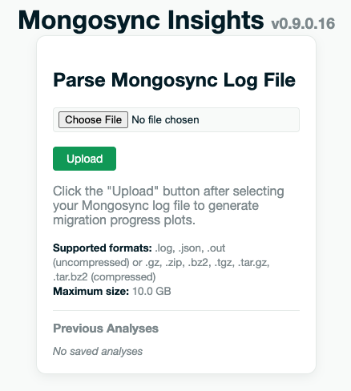

# Log Analyzer

The Log Analyzer parses uploaded **mongosync** log and metrics files offline and builds interactive charts, tables, and searchable log views. Open it from the hub (**Log analyzer** → **Open log analyzer**) or go directly to `/logs/`.


## Upload a file

On the Log analyzer home page, use **Parse Mongosync Files** to select a file and click **Upload**.



### Supported formats

| Type | Extensions |
|------|------------|
| Uncompressed logs | `.log`, `.json`, `.out` |
| Compressed archives | `.gz`, `.zip`, `.bz2`, `.tgz`, `.tar.gz`, `.tar.bz2` |

Maximum upload size defaults to **10 GB** (`MI_MAX_FILE_SIZE`).

### What gets parsed

Mongosync Insights detects two kinds of content in the uploaded file:

1. **Structured mongosync JSON log lines** — the main migration log (`mongosync.log` or rotated segments). These drive the **Mongosync Logs** tab and the info/error/log-viewer tabs.
2. **Prometheus metrics lines** (when present) — typically from `mongosync_metrics.log`. These drive the **Mongosync Metrics** tab.

A single upload can contain log lines only, metrics only, or both. Tabs appear based on what was found.

### Log verbosity

Charts and panels depend on the **verbosity level** mongosync used when the log was captured. For full chart coverage (including partition init duration/count), capture logs with at least `--verbosity 1`:

```bash
mongosync --cluster0 "..." --cluster1 "..." --verbosity 1
```

See **[LOG_VERBOSITY.md](LOG_VERBOSITY.md)** for a complete chart-to-verbosity mapping.

## Analysis results tabs

After parsing, the results page shows one or more tabs:

| Tab | When shown | Purpose |
|-----|------------|---------|
| **Mongosync Logs** | Log lines found | Time-series charts: phases, lag, copy progress, CEA, indexes, verifier, etc. |
| **Mongosync Metrics** | Prometheus metrics found | Charts from `mongosync_metrics.json` (OTel/Prometheus exposition in log lines) |
| **Mongosync Options** | Log lines found | Version info, startup options, hidden flags, `/api/v1/start` request body |
| **Collections and Partitions** | Log lines found | Natural-order collections and per-collection partition tables |
| **Errors and Warnings** | Log lines found | Pattern-matched errors with optional recommendations |
| **Log Viewer** | Log lines found | Tail view and full-text search over indexed log lines |

### Mongosync Logs

Interactive Plotly charts grouped by section (global migration, collection copy, CEA, indexes, verifier). Zoom, pan, and toggle series from the legend.


### Mongosync Metrics

Separate dashboard for Prometheus-style metrics embedded in metrics log files (rates, counters, histograms configured in `lib/mongosync_metrics.json`).


### Mongosync Options

Read-only tables for:

- **Version Info** — mongosync build/version line from startup
- **Mongosync Options** — flags logged at startup
- **Mongosync Hidden Options** — internal/hidden flags
- **Mongosync Start Options** — JSON body from the `/api/v1/start` request

> **Note:** Startup options and version info appear only in the **first** log segment after mongosync starts. If you upload a rotated or partial file from mid-migration, these panels may be empty — use the earlier rotated file or the segment that contains startup/start.


### Collections and Partitions

- **Collections Copied in Natural Order** — namespaces selected for natural-order reads
- **Collection Partitions** — per-collection partition progress tables (searchable, exportable as Markdown)


### Errors and Warnings

Log lines matched against **`error_patterns.json`** (or a custom file via `MI_ERROR_PATTERNS_FILE`). Each match shows a friendly name, the log excerpt, timestamp, and an optional **recommendation** for common failure modes (oplog rollover, duplicate key, index conflicts, CEA failures, etc.).

Filter the table with the search box or **Copy as Markdown** for sharing.


### Log Viewer

Indexed log lines are stored in a SQLite **log store** for fast search without re-uploading.

- **Tail** — last N lines (default **2000**, `MI_LOG_VIEWER_MAX_LINES`)
- **Search** — full-text search with level filter and pagination
- **Focus** — quick filters for errors, warnings, or custom text
- **Download** — export the tail buffer as a `.log` file


## Previous analyses (snapshots)

Each successful parse saves an **analysis snapshot** on disk (JSON + metadata) and registers a SQLite log store. The Log analyzer home page lists **Previous Analyses** with filename, date, size, and age.

From the results page sidebar you can also browse, load, or delete saved analyses.

### Duplicate upload

If you upload a file that matches an existing saved analysis (same filename), MI prompts you to:

- **Load Previous** — open the saved snapshot (no re-parse)
- **Replace** — delete the old snapshot and parse again
- **Cancel** — abort the upload

### Snapshot retention

By default, snapshots and log stores live under the system temp directory and expire after **24 hours** (`MI_LOG_STORE_MAX_AGE_HOURS`). Set a persistent directory for longer retention:

```bash
export MI_LOG_STORE_DIR=/data/mongosync-insights/store
export MI_LOG_STORE_MAX_AGE_HOURS=48
```

Snapshots are removed on logout, app startup maintenance, and when TTL expires. Loading a snapshot refreshes its age.

## Configuration

| Variable | Default | Log Analyzer use |
|----------|---------|------------------|
| `MI_MAX_FILE_SIZE` | `10737418240` (10 GB) | Max upload size |
| `MI_ERROR_PATTERNS_FILE` | `lib/error_patterns.json` | Custom error pattern definitions |
| `MI_LOG_STORE_DIR` | OS temp | Snapshot and log-store directory |
| `MI_LOG_STORE_MAX_AGE_HOURS` | `24` | Snapshot/log-store TTL |
| `MI_LOG_VIEWER_MAX_LINES` | `2000` | Tail view line limit |
| `MI_MAX_PARTITIONS_DISPLAY` | `10` | Max partitions shown per collection in tables |

See **[CONFIGURATION.md](CONFIGURATION.md)** for examples (upload size, persistent snapshots, log viewer buffer).

## Log analyzer vs Migration Monitoring

| | Log Analyzer | Migration Monitoring |
|---|--------------|----------------------|
| **Input** | Upload log/metrics files | Live connection string and/or progress endpoint |
| **Timing** | Post-hoc / historical | Real-time polling |
| **Best for** | Deep dive on completed or in-progress runs from logs | Live dashboard while mongosync is running |

Use both when troubleshooting: Migration Monitoring for current state, Log Analyzer for historical trends and full log search.

See **[MIGRATION_MONITORING.md](MIGRATION_MONITORING.md)** for the live dashboard.

## Related documentation

- **[LOG_VERBOSITY.md](LOG_VERBOSITY.md)** — mongosync verbosity levels and chart coverage
- **[CONFIGURATION.md](CONFIGURATION.md)** — environment variables
- **[README.md](README.md)** — quick start

### License

[Apache 2.0](http://www.apache.org/licenses/LICENSE-2.0)

DISCLAIMER
----------
Please note: all tools/ scripts in this repo are released for use "AS IS" **without any warranties of any kind**,
including, but not limited to their installation, use, or performance.  We disclaim any and all warranties, either 
express or implied, including but not limited to any warranty of noninfringement, merchantability, and/ or fitness 
for a particular purpose.  We do not warrant that the technology will meet your requirements, that the operation 
thereof will be uninterrupted or error-free, or that any errors will be corrected.

Any use of these scripts and tools is **at your own risk**.  There is no guarantee that they have been through 
thorough testing in a comparable environment and we are not responsible for any damage or data loss incurred with 
their use.

You are responsible for reviewing and testing any scripts you run *thoroughly* before use in any non-testing 
environment.

Thanks,  
The MongoDB Support Team