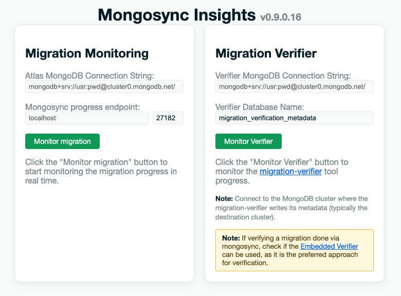
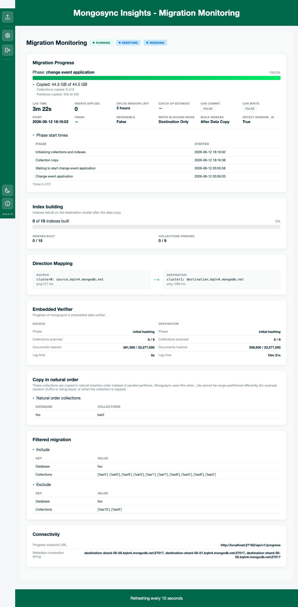

# Migration Monitoring

Migration Monitoring is the real-time dashboard for ongoing **mongosync** cluster-to-cluster migrations. Open it from the hub (**Migration monitoring** → **Open migration monitoring**) or go directly to `/live/`.



## What it shows

The dashboard polls mongosync and/or the destination metadata database and renders cards for:

- **Migration state** — coordinator state badge (e.g. `RUNNING`, `PAUSED`, `COMMITTED`)
- **Migration progress** — copy phase, bytes/collections/partitions, lag time, phase start times
- **Index building** — indexes rebuilt on the destination after the initial copy
- **Embedded Verifier** — mongosync's built-in verifier (when enabled)
- **Filtered migration** — namespace include/exclude filters and natural-order copy settings (from metadata)

Refresh interval defaults to **10 seconds** (`MI_REFRESH_TIME`).



## Configuration inputs

You can provide **one or both** of the following on the Migration monitoring home form (or via environment variables):

| Input | Purpose | Env variable |
|-------|---------|--------------|
| **MongoDB connection string** | Read mongosync internal metadata on the destination cluster (`resumeData`, `globalState`, `indexCorrection`, verifier persistence DBs) | `MI_CONNECTION_STRING` |
| **Mongosync progress endpoint** | Poll mongosync's HTTP progress API (`/api/v1/progress`) | `MI_PROGRESS_ENDPOINT_URL` |

At least one must be configured to start a session.

### Progress endpoint (UI)

When not set via `MI_PROGRESS_ENDPOINT_URL`, the form asks for:

- **Host** — hostname or IP (e.g. `localhost`). Leave **empty** to skip the progress endpoint and use metadata-only monitoring.
- **Port** — defaults to **27182** (mongosync's default API port).

The path `/api/v1/progress` is fixed and appended automatically; do not enter it in the UI.

### Progress endpoint (environment)

`MI_PROGRESS_ENDPOINT_URL` accepts either form:

```bash
export MI_PROGRESS_ENDPOINT_URL="localhost:27182"
# or
export MI_PROGRESS_ENDPOINT_URL="localhost:27182/api/v1/progress"
```

A leading `http://` or `https://` prefix is stripped on load.

## Data source priority

When **both** the progress endpoint and connection string are configured:

1. **Progress endpoint** is the primary source for in-memory progress (copy stats, index building tracker, embedded verifier snapshot from mongosync).
2. **Metadata database** fills gaps when the progress endpoint is unavailable, or when the endpoint does not expose index-building or verification data.

If the progress endpoint fails to respond, the dashboard still loads metadata when a connection string is available, and shows a progress-endpoint warning.

## Index building (metadata fallback)

When the progress endpoint is not used or does not report index-building data, MI reads **`indexCorrection`** counters from the internal metadata database.

If counters lag behind reality (indexes already exist on the destination but counters are pending), MI optionally verifies pending indexes by **index name** on the destination cluster. That fallback is **approximate** — the Index building card shows:

> *Progress from metadata (approximate).*

Control how often destination `list_indexes` scans run with:

```bash
export MI_INDEX_BUILD_REFRESH_TIME=60   # seconds; default 60
```

The counter aggregate still runs on every poll; only the destination verification scan is throttled.

Index-building progress is suppressed when `buildIndexes` is `never`, or before the copy phase reaches the appropriate stage (CEA gating).

## Embedded Verifier vs migration-verifier tool

Migration Monitoring includes two separate verifier workflows:

| Feature | Where | Data source |
|---------|-------|-------------|
| **Embedded Verifier** card | Migration Monitoring dashboard | Progress endpoint and/or mongosync verifier persistence on the destination (`__mdb_internal_mongosync_verifier_src` / `_dst`). Requires mongosync **verifier persistence** (`enableVerifierPersistence`). |
| **Migration Verifier** form | Same `/live/` page, second card | External [migration-verifier](https://github.com/mongodb-labs/migration-verifier) tool metadata database (`MI_VERIFIER_CONNECTION_STRING`). |

When metadata is used for embedded verifier progress, the card notes that progress is **approximate**.

## Migration Verifier monitoring

The second form on `/live/` monitors the standalone migration-verifier tool (not mongosync embedded verifier). Configure via `MI_VERIFIER_CONNECTION_STRING` or the UI; it falls back to `MI_CONNECTION_STRING` when unset.


## Related documentation

- **[CONFIGURATION.md](CONFIGURATION.md)** — environment variables (`MI_REFRESH_TIME`, `MI_PROGRESS_ENDPOINT_URL`, `MI_INDEX_BUILD_REFRESH_TIME`, etc.)
- **[LOG_ANALYZER.md](LOG_ANALYZER.md)** — offline log analysis
- **[CONNECTION_STRING.md](CONNECTION_STRING.md)** — connection string formats and security
- **[PACKAGING.md](PACKAGING.md)** — pre-configuring env vars in packaged installs

### License

[Apache 2.0](http://www.apache.org/licenses/LICENSE-2.0)

DISCLAIMER
----------
Please note: all tools/ scripts in this repo are released for use "AS IS" **without any warranties of any kind**,
including, but not limited to their installation, use, or performance.  We disclaim any and all warranties, either 
express or implied, including but not limited to any warranty of noninfringement, merchantability, and/ or fitness 
for a particular purpose.  We do not warrant that the technology will meet your requirements, that the operation 
thereof will be uninterrupted or error-free, or that any errors will be corrected.

Any use of these scripts and tools is **at your own risk**.  There is no guarantee that they have been through 
thorough testing in a comparable environment and we are not responsible for any damage or data loss incurred with 
their use.

You are responsible for reviewing and testing any scripts you run *thoroughly* before use in any non-testing 
environment.

Thanks,  
The MongoDB Support Team