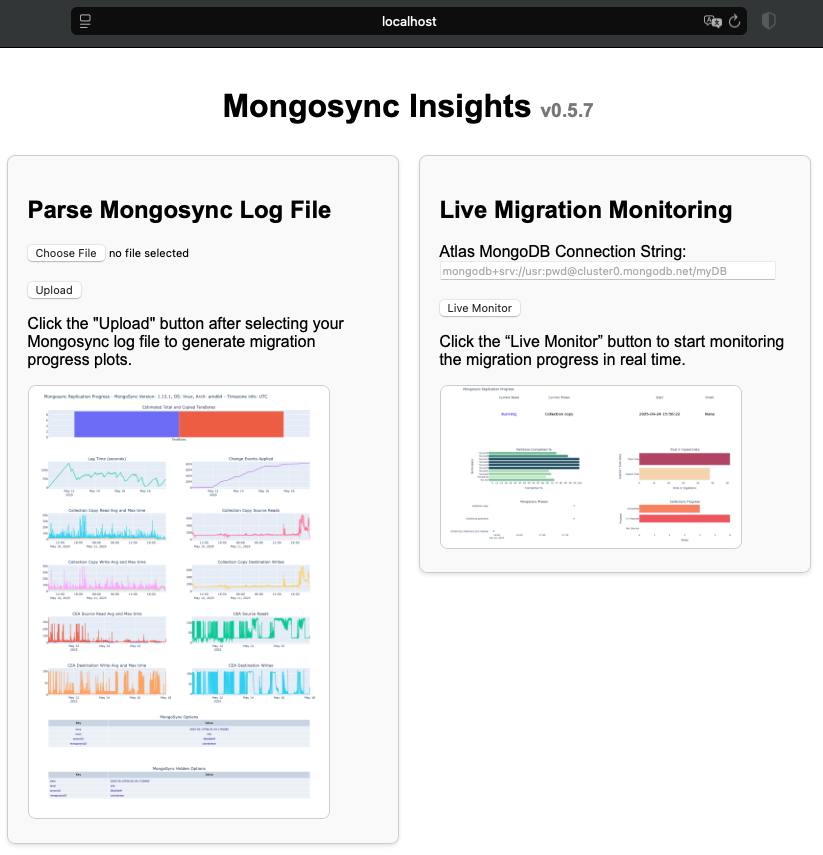
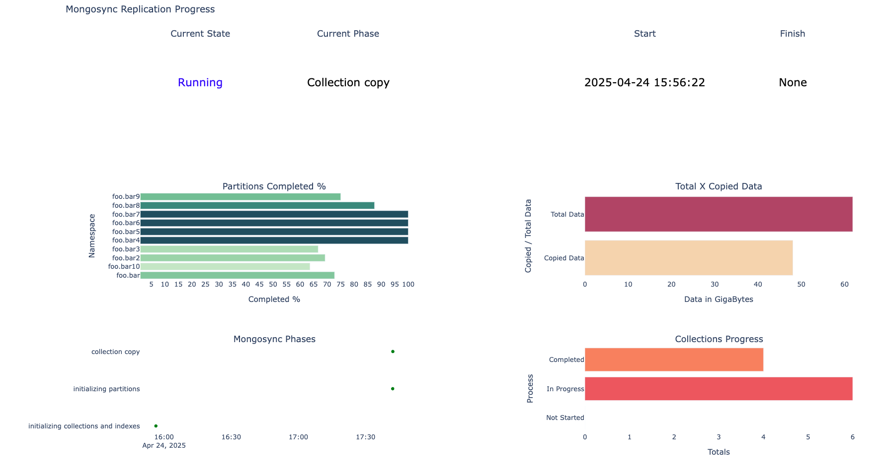

# Mongosync Insights

This project parses **mongosync** logs and metadata, generating a variety of plots to assist with monitoring and troubleshooting ongoing mongosync migrations.

## requirements.txt

Mongosync Insights requires Python version 3.10+.

The `requirements.txt` file lists the Python packages on which the scripts depend. The packages are specified with their version numbers to ensure compatibility.          

To install the dependencies, use the following command:

```bash
pip3 install -r requirements.txt
```

Run the script in the Python environment where you want to run it. If you're using a virtual environment, activate it first.

## Getting Started

1. Download the Mongosync Insigths folder.
2. Navigate to the directory containing the Python script and the `requirements.txt` file.
3. Install the dependencies with `pip3 install -r requirements.txt`.
4. Run the script `python3 mongosync_insights.py`.

Please note that you need Python and pip installed on your machine to run the script and install the dependencies.

## Accessing the Application and Viewing Plots

Once the application runs, you can access it by opening a web browser and navigating to `http://localhost:3030`. It assumes the application runs on the same machine where you're opening the browser and is configured to listen on port 3030.



### Uploading the mongosync Log File

The application provides a user interface for uploading the `mongosync` log file. Clicking a "Browse" or "Choose File" button, select the file from your file system, and then click on "Open" or "Upload" button.

### Reading the Metadata

When running for the first time, the application will provide a form requesting the target's connection string. 
Clicking the "Read Metadata" it will save the connection string in the `config.ini` and the page will refresh with the plots.

## Viewing the Plot Information

Once the `mongosync` data is loaded, the application processes the data and generates the plots. 

If the plots aren't visible after uploading the file, you may need to refresh the page. If the plots still aren't visible, check for any error messages or notifications from the application.

### Mongosync Logs

This script processes the Mongosync logs and generates various plots. The plots include scatter plots and tables, and they visualize different aspects of the data, such as `Total and Copied bytes`, `CEA Reads and Writes`, `Collection Copy Reads and Writes`, `Events applied`, and `Lag Time`.


### Mongosync Metadata

This script processes Mongosync metadata and generates various plots refreshing every 10 seconds by default. The plots visualize different aspects of the data, such as `Partitions Completed`, `Data Copied`, `Phases`, and `Collection Progress`.



### License

[Apache 2.0](http://www.apache.org/licenses/LICENSE-2.0)

DISCLAIMER
----------
Please note: all tools/ scripts in this repo are released for use "AS IS" **without any warranties of any kind**,
including, but not limited to their installation, use, or performance.  We disclaim any and all warranties, either 
express or implied, including but not limited to any warranty of noninfringement, merchantability, and/ or fitness 
for a particular purpose.  We do not warrant that the technology will meet your requirements, that the operation 
thereof will be uninterrupted or error-free, or that any errors will be corrected.

Any use of these scripts and tools is **at your own risk**.  There is no guarantee that they have been through 
thorough testing in a comparable environment and we are not responsible for any damage or data loss incurred with 
their use.

You are responsible for reviewing and testing any scripts you run *thoroughly* before use in any non-testing 
environment.

Thanks,  
The MongoDB Support Team
