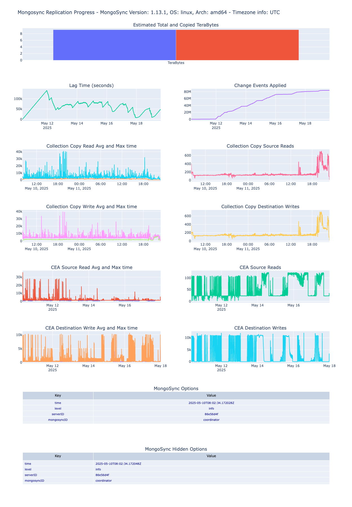
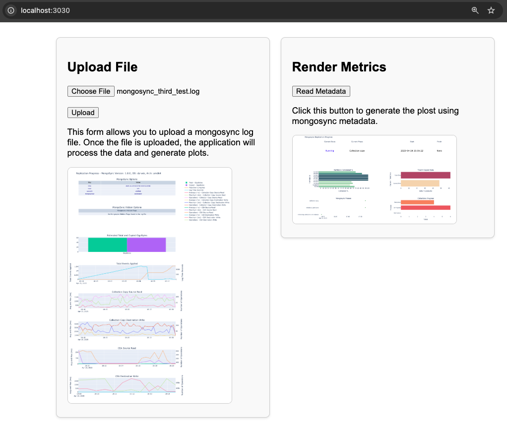

# mongosync_metrics_python

This project contains Python scripts, which process the `mongosync` data and generate various plots using Plotly on port **3030**. The script also includes a `requirements.txt` file listing the Python dependencies.

## Mongosync Logs

This script processes the Mongosync logs and generates various plots using Plotly. The plots include scatter plots and tables, and they visualize different aspects of the data, such as `Total and Copied bytes`, `CEA Reads and Writes`, `Collection Copy Reads and Writes`, `Events applied`, and `Lag Time`.



## Mongosync Metadata

This script processes Mongosync metadata and generates various plots using Plotly. The plots include scatter plots, and they visualize different aspects of the data, such as `Partitions Completed`, `Data Copied`, `Phases`, and `Collection Progress`.


## requirements.txt

The `requirements.txt` file lists the Python packages that the scripts depend on. The packages are specified with their version numbers to ensure compatibility.          

To install the dependencies, use the following command:

```bash
pip install -r requirements.txt
```

This command should be run in the Python environment where you want to run the script. If you're using a virtual environment, make sure to activate it first.

## Getting Started

1. Clone the repository to your local machine.
2. Navigate to the directory containing the Python script and the `requirements.txt` file.
3. Install the dependencies with `pip install -r requirements.txt`.
4. Run the script `python3 mongosync_plot.py`.

Please note that you need to have Python and pip installed on your machine to run the script and install the dependencies.

## Accessing the Application and Viewing Plots

Once the application is running, you can access it by opening a web browser and navigating to `http://localhost:3030`. This assumes that the application is running on the same machine where you're opening the browser, and that it's configured to listen on port 3030.



## Uploading the mongosync Log File

The application provides a user interface for uploading the `mongosync` log file. Clicking a "Browse" or "Choose File" button, select the file from your file system, and then click an "Open" or "Upload" button.

## Reading the Metadata

Before running the script, change the variable `TARGET_MONGO_URI` in `mongosync_plot_metadata.py`, to use the target's connection string. 
Once the script is running, click the "Read Metadata" button and wait for the page to refresh.

## Viewing the Plot Information

Once the `mongosync` data is loaded, the application processes the data and generates the plots. 

If the plots aren't immediately visible after uploading the file, you may need to refresh the page. If the plots still aren't visible, check for any error messages or notifications from the application.
